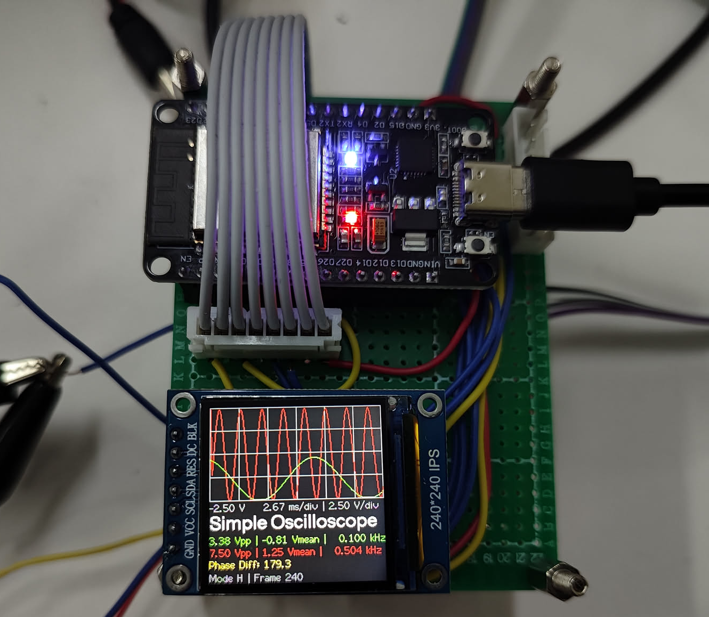

# NanoScope - ESP32 微型双通道示波器

基于 ESP32 + TFT 的微型示波器项目。ESP32 负责串口接收 STM32 ADC 采样数据、实时波形绘制、频率与相位差计算、以及蓝牙通信；支持手机 App 远程控制显示参数。

-> [STM32 采样前端项目地址](https://github.com/FibreCase/NanoScope-ADC)



## 项目特性

- 双通道输入（CH1/CH2）
- 电压量程支持 0-12V（通过前端分压/偏置后映射到 ADC）
- 实时显示波形、Vpp、Vmean、频率
- 同频条件下相位差测量（上升沿时间差法）
- 蓝牙串口控制（手机 App 调节显示参数）
- 可切换采样率模式，并可下发触发相关配置到 STM32

## 系统架构

1. STM32 作为采样前端，完成双路 ADC 采样和频率统计。
2. STM32 通过高速串口发送数据帧给 ESP32。
3. ESP32 解析数据帧后：
	 - 在 TFT 上绘制波形
	 - 计算并显示测量信息
	 - 根据蓝牙命令更新显示/触发设置
4. 手机 App 通过蓝牙串口与 ESP32 通信。

## 功能实现

### 1) 串口数据接收与帧解析

- 串口参数定义在 `include/data_serial_task.h`：
	- `SERIAL_BAUD_RATE = 2250000`
	- `SERIAL_RX_PIN = 16`，`SERIAL_TX_PIN = 17`
- 解析状态机在 `src/data_serial_task.cpp`：
	- 帧头：`0xFF 0xFE`
	- 频率数据：8 字节（两个 `uint32_t`）
	- ADC 数据：`RECV_ADC_DATA_SIZE = 8000` 字节（双通道交织）
	- 帧尾校验：`0xDE 0xAD 0xEF`
- 使用双缓冲减少撕裂与竞争：`recv_adc_buf[2][...]`。

### 2) 波形与测量值计算

- `src/data_controller.cpp` 中：
	- 每帧统计 CH1/CH2 的 `max/min` 计算 `Vpp`
	- 用一阶低通平滑 `Vpp`（`LOW_PASS_FILTER_RATE = 0.2`）
	- `Vmean` 取 `(max + min)/2`
	- 频率由串口帧中 `uint32_t` 转换为 `kHz`
- 显示信息生成：
	- 电压/时基/每格电压（`axis_info`）
	- 通道信息：`Vpp | Vmean | 频率`（`channel_info`）
	- 模式信息：采样率模式、电压模式、触发状态、帧计数（`mode_info`）

### 3) TFT 刷新任务

- `src/tft_task.cpp` 中创建三个任务：
	- `taskWaveSet`：处理蓝牙下发设置
	- `taskWaveRefresh`：波形与信息刷新
	- `taskPhaseDiffCalc`：相位差计算
- 波形绘制策略：
	- 将采样数据按屏幕宽度做分箱平均
	- CH1 绿色、CH2 红色连线
	- 背景网格线辅助观察

### 4) 相位差测量

- 使用中断上升沿测时（`CH1_PHASE_DIFF_PIN = 13`，`CH2_PHASE_DIFF_PIN = 12`）。
- 测得 `dt` 后结合频率换算相位：
	- `phase = dt / period * 360`
	- 归一化到 `[-180, 180)`
- 若两通道频率差过大或频率过低，显示为无效（源码中用 `270.0` 作为哨兵值）。

### 5) 蓝牙通信与手机控制

- 蓝牙名称：`Fibre_ESP32_OSC`（`src/bluetooth_task.cpp`）。
- 蓝牙接收协议：`0xFF 0xFE + ID + 4字节数据`。
- 支持控制项（ID）：
	- `0x01` X 范围
	- `0x02` Y 范围
	- `0x03` X 偏移
	- `0x04` Y 偏移
	- `0x05` 电压模式（高/低）
	- `0x06` 采样率模式（高/低）
	- `0x07` 触发开关
	- `0x08` 触发电压
- 心跳包：主循环每秒发送 `0xF0`。

### 6) ESP32 -> STM32 控制

- 串口命令发送格式：`0xFA 0xFE + cmd + 4字节data`。
- 已实现命令：
	- `STM32_CMD_SET_SR (0x01)`：设置采样率模式
	- `STM32_CMD_SET_TRIG (0x02)`：设置触发开关

## 开发环境

- 平台：PlatformIO
- 芯片：ESP32 Dev Module
- 框架：Arduino
- 关键配置（`platformio.ini`）：
	- `monitor_speed = 921600`
	- `upload_speed = 921600`

## 代码结构

```text
include/
	main.h                # 全局宏与事件位
	bluetooth_task.h      # 蓝牙协议与任务接口
	data_serial_task.h    # STM32串口数据协议与接口
	data_controller.h     # 波形计算与显示数据结构
	tft_task.h            # TFT相关任务接口

src/
	main.cpp              # 系统初始化与主循环
	bluetooth_task.cpp    # 蓝牙接收状态机与心跳
	data_serial_task.cpp  # 串口接收状态机、双缓冲
	data_controller.cpp   # Vpp/Vmean/频率/相位差处理
	tft_task.cpp          # 波形绘制与界面刷新
```

## 运行说明

1. 准备硬件连接：
	 - STM32 串口 -> ESP32 `RX=16`/`TX=17`
	 - 相位检测信号 -> ESP32 `GPIO13`（CH1）/`GPIO12`（CH2）
	 - TFT 按 `TFT_eSPI` 配置连接
2. 使用 PlatformIO 编译并烧录 ESP32 固件。
3. 上电后等待屏幕进入示波界面。
4. 手机端通过蓝牙连接 `Fibre_ESP32_OSC`，发送控制指令调整显示。

## 注意事项

- 0-12V 输入依赖模拟前端（分压/偏置/保护），请勿将高压直接接入 ESP32 引脚。
- 相位差测量精度受信号质量、边沿抖动、采样与中断延迟影响。
